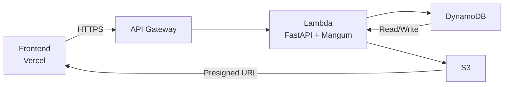

# 📜 **Echoes**  
*An AI-Powered Legacy Book Builder*  
Built for the **OpenAI Build Week (Codex Hackathon)**

> Transform fleeting memories into enduring heirlooms. Echoes is an interactive biography studio where AI listens, refines, and weaves your life stories into a structured 3D scroll and printable legacy book—crafted with wonder, kept forever.

---

## ✨ What It Does
Echoes reimagines digital storytelling as a *tangible ritual*:
- 🎙️ **Converse naturally** with your Royal Biographer (AI) via text, voice, or image uploads.
- 🧾 **AI Polishes Your Voice**: Every memory generates two versions:  
  • `Original Voice` (your raw words)  
  • `Biographer’s Polish` (elegant, narrative-ready prose)
- 🎨 **Design Your Legacy**: In Preview Mode, drag-and-drop polaroids, text blocks, and embellishments to curate a bespoke layout—no design skills needed.
- 📖 **Export a Heirloom Book**: Generate a print-ready PDF with embedded fonts, high-res images, and custom parchment styling—ready to share or print.

---

## ⚙️ Architecture & Deployment

### Frontend
- **Framework**: Next.js 14 (App Router), TypeScript
- **Styling**: Tailwind CSS + Custom CSS for magical aesthetics (aged parchment, gold filigree, starry voids)
- **State Management**: Zustand (lightweight, performant, no side effects)

### Backend
- **Framework**: FastAPI (Python 3.12) + Mangum (Lambda adapter)
- **AI Integration**: DeepSeek-R1 via Replicate API for narrative generation and layout intelligence
- **Storage**: 
  - **DynamoDB**: Serverless NoSQL for biography structure & metadata
  - **S3**: Secure media hosting with presigned URLs for direct uploads
- **Deployment**: **AWS Lambda (ARM64/Graviton2)** — manually packaged and deployed for full control and cost efficiency

### Infrastructure Flow


> 🔐 **Security First**: All credentials are managed via AWS Secrets Manager (not hardcoded).

---

## 🛠️ How I Used Codex & GPT-5.6
I leveraged Codex and GPT-5.6 to accelerate development of complex, high-fidelity components:
- Generated the intricate Three.js texture-mapping logic for the Living Scroll canvas.
- Built robust async FastAPI endpoints with aioboto3 for DynamoDB/S3 integration.
- Engineered the SSE streaming parser for real-time AI responses with zero latency artifacts.
- Designed Pydantic models for strict API validation and error resilience.
- Wrote AWS infrastructure initialization scripts (`init_db.py`) and Lambda packaging logic.

---

## 📦 Post-Deployment Steps (For Judges)
To run locally or verify:
1. **Backend**:  
   ```bash
   cd backend
   pip install -r requirements.txt
   uvicorn app.main:app --reload
   ```
2. **Frontend**:  
   ```bash
   cd frontend
   npm install && npm run dev
   ```
3. **Environment Variables**:  
   Set `.env.local` with `NEXT_PUBLIC_API_URL=http://localhost:8000/api/v1` and required AWS/Replicate keys.

> 🌐 **Live Demo**: A private, secure demo link is available upon request via Devpost messaging to protect user data privacy.


---

## 🌟 Why This Stands Out
- **Not just chat**: Echoes solves the *curation problem*—AI does the heavy lifting, users refine the art.
- **Production-grade**: Manual Lambda deployment ensures ARM64 optimization, lower cost, and full control.
- **Emotional design**: Every pixel—from gold filigree to parchment grain—is crafted to evoke nostalgia and reverence.
- **Hackathon-ready**: Built end-to-end in <7 days, with zero external dependencies beyond core stack.

---

> *"Every life leaves a little magic."*  
> — Echoes, by Abhishek Mishra | OpenAI Codex Hackathon 2026

---
